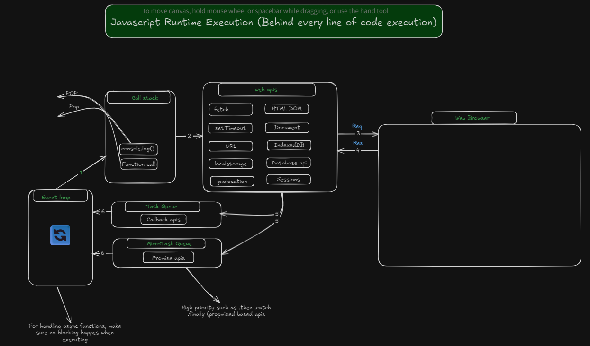

In javascript, the event loop use to control the execution traffic, make sure all the code runs properly without no blocking, even js is single thread and can handle one one task at a time. 

## key components
> Event Loop (traffic control)
> Call stack (execute synchronous only line by line)
> Web apis (executes asynchronous code) handle by browser/node engine
> Callback queue (stores callbacks, function)
> Microtask queue (stores promises) first priority

## Js runtime execution
