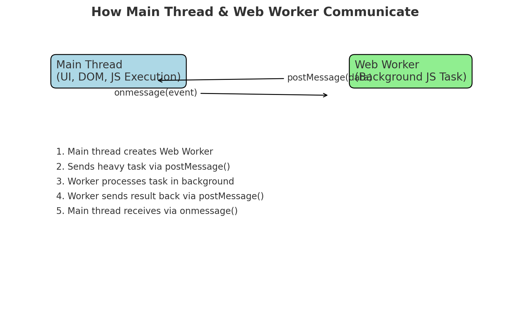

## definition
A web worker in js is a features that allows you to run scripts in a background thread separate from main UI thread. This helps perform heavy computations without freezing the UI

## syntax
``` 
//main.js
const worker = new Worker("worker.js) //Create worker
worker.postMessage("Hello worker") // send msg to worker
worker.onmessage = function(event){
    console.log("Message from worker", event.data)
}
```

## How It Works in Background
JavaScript runs in a single main thread by default.

When you create a Web Worker, the browser spins up a separate background thread.

The main thread and worker communicate via message passing (postMessage & onmessage).

Workers do not have access to the DOM (for safety and thread separation).

Data is copied, not shared (structured cloning).

> If you need DOM access or React state updates, you cannot do that in a Web Worker.Instead, use the worker for pure computations and send results back to the main thread.

